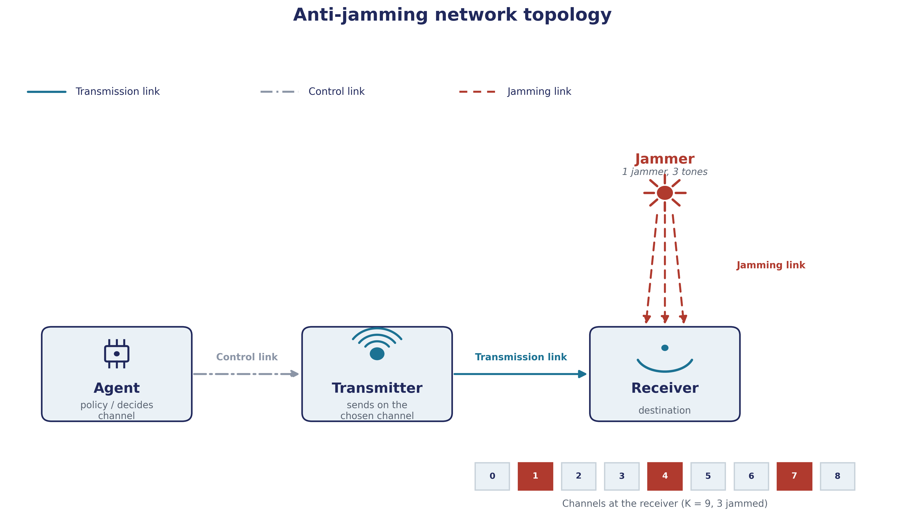
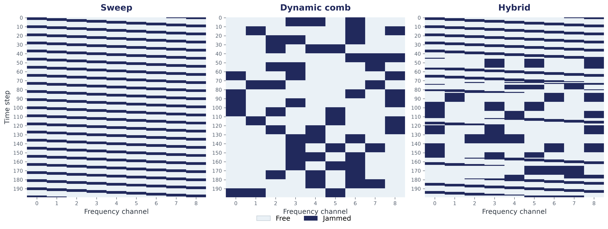

# Anti-Jamming Communications: Spectrum Waterfall Deep RL

## Abstract

A transmitter must pick one of K frequency channels at every time step while a jammer tries
to block it. This project formulates the problem as an MDP and compares tabular Q-learning
and a convolutional DQN — trained on a spectrum waterfall observation — against three
non-learning baselines (Fixed, Random, Reactive) across three jamming patterns (sweep,
dynamic comb, hybrid). Performance is reported relative to r*, the optimal achievable reward
under the same information the agents have, computed exactly via average-reward policy
iteration.

## Overview

<p align="center">
  <br>
  <em>Agent, transmitter, receiver, and jammer — the components of the environment.</em>
</p>

<p align="center">
  <br>
  <em>The three jamming patterns: sweep, dynamic comb, hybrid.</em>
</p>

## Repository structure

```
anti_jamming_rl/
├── README.md
├── Anti-Jamming-Communications-Spectrum-Waterfall-Deep-RL-python.ipynb
├── requirements.txt
│
├── configs/
│   ├── jammers.yaml
│   ├── agent.yaml
│   └── simulation.yaml
│
├── src/
│   └── anti_jamming_rl/
│       ├── __init__.py
│       ├── envs/
│       │   ├── __init__.py
│       │   ├── base_env.py
│       │   ├── state_builder.py
│       │   └── jammers.py
│       ├── agents/
│       │   ├── __init__.py
│       │   ├── base_agent.py
│       │   ├── baselines.py
│       │   ├── qlearning.py
│       │   └── dqn.py
│       ├── train/
│       │   ├── __init__.py
│       │   ├── train_loop.py
│       │   └── evaluation.py
│       └── validation/
│           ├── __init__.py
│           └── policy_iteration.py
```

## Usage

This project is explored entirely through the notebook — there is no separate CLI entry point.

```bash
git clone https://github.com/tavaa/Anti-Jamming-Communications-Spectrum-Waterfall-Deep-RL.git
cd Anti-Jamming-Communications-Spectrum-Waterfall-Deep-RL

# create environment (conda)
conda create -n anti-jamming-rl python=3.10 -y
conda activate anti-jamming-rl

# install dependencies
pip install -r requirements.txt

# open the notebook
jupyter notebook Anti-Jamming-Communications-Spectrum-Waterfall-Deep-RL.ipynb
```

All experiments — environment setup, r* computation, training, evaluation, and figures — are
run from within the notebook, using the configuration files in `configs/`.

## Results

**Optimal reward per scenario (policy iteration):**

| Scenario     | r*       |
|--------------|:--------:|
| Sweep        | 0.966667 |
| Dynamic comb | 0.960000 |
| Hybrid       | 0.961561 |

**In-domain performance** — frozen policy, own seed. η% = reward as a percentage of r*.

*Sweep (r\* = 0.966667)*

| Method     | r̄      | μ̄     | σ̄     | η%    | Train time (s) |
|------------|:------:|:------:|:------:|:-----:|:---------------:|
| Q-learning | 0.8446 | 1.0000 | 0.7770 | 87.37 | 0.3             |
| DQN        | 0.9112 | 1.0000 | 0.4440 | 94.26 | 42.9            |
| Fixed      | 0.6670 | 0.6670 | 0.0000 | 69.00 | —               |
| Random     | 0.4869 | 0.6645 | 0.8895 | 50.37 | —               |
| Reactive   | 0.6556 | 0.7130 | 0.2870 | 67.82 | —               |

*Dynamic comb (r\* = 0.960000)*

| Method     | r̄      | μ̄     | σ̄     | η%    | Train time (s) |
|------------|:------:|:------:|:------:|:-----:|:---------------:|
| Q-learning | 0.8515 | 0.9625 | 0.5250 | 88.70 | 0.3             |
| DQN        | 0.9194 | 0.9655 | 0.2670 | 95.77 | 37.2            |
| Fixed      | 0.6450 | 0.6450 | 0.0000 | 67.19 | —               |
| Random     | 0.4876 | 0.6655 | 0.8895 | 50.79 | —               |
| Reactive   | 0.9502 | 0.9585 | 0.0415 | 98.98 | —               |

*Hybrid (r\* = 0.961561)*

| Method     | r̄      | μ̄     | σ̄     | η%    | Train time (s) |
|------------|:------:|:------:|:------:|:-----:|:---------------:|
| Q-learning | 0.8219 | 0.9665 | 0.7160 | 85.48 | 0.9             |
| DQN        | 0.9066 | 0.9805 | 0.3940 | 94.28 | 35.6            |
| Fixed      | 0.6585 | 0.6585 | 0.0000 | 68.48 | —               |
| Random     | 0.4896 | 0.6665 | 0.8895 | 50.92 | —               |
| Reactive   | 0.8093 | 0.8410 | 0.1585 | 84.17 | —               |

<p align="center">
  <br>
  <em>Cross-domain transfer: reward as % of r*, training scenario (rows) vs. test scenario (columns).</em>
</p>

## Reference

X. Liu, Y. Xu, L. Jia, Q. Wu, and A. Anpalagan, "Anti-Jamming Communications Using Spectrum
Waterfall: A Deep Reinforcement Learning Approach," *IEEE Communications Letters*, vol. 22,
no. 5, pp. 998–1001, May 2018. doi: [10.1109/LCOMM.2018.2815018](https://doi.org/10.1109/LCOMM.2018.2815018)
